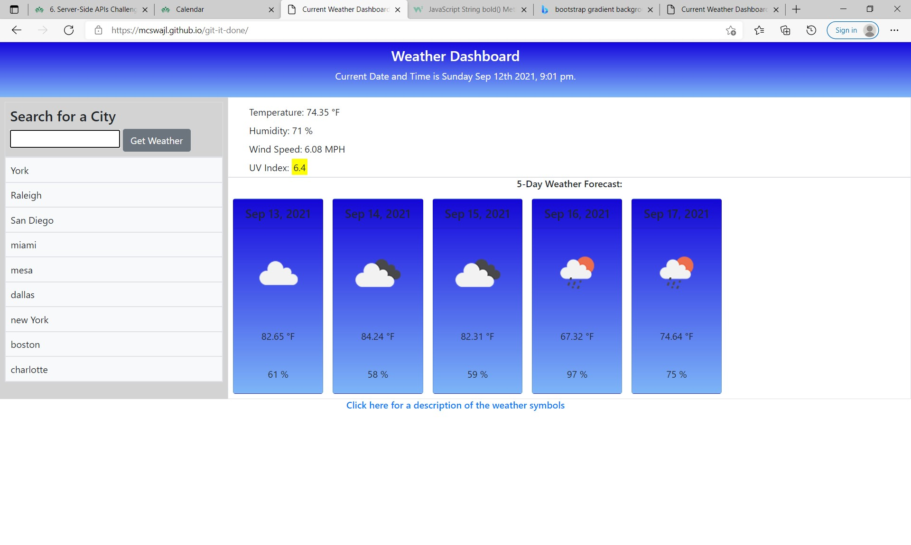

# ## User Story: Weather Dashboard

My weather dashboard retrieves current weather data from another application's API was the user types in the name of a city and clicks search. I have several third-party APIs sourced in my html allowing me to access their data and functionality by making requests with specific parameters to a URL. I included code to display the current data and time. Also, at the bottom of the 5 day forecast I included a link (hyperlinked text) to the Open weather webpage that explains the weather icons symbols. I learned more about bootstrap during this challenge, things like, bg-primary, p-2, container-fluid,etc.

## Screenshot

Screenshot of my website


## I was provided the following API source and told to use local storage

Use the [OpenWeather One Call API](https://openweathermap.org/api/one-call-api) to retrieve weather data for cities. Read through the documentation for setup and usage instructions. You will use `localStorage` to store any persistent data.

## This is the acceptance criteria that I had to include in my website

```
GIVEN a weather dashboard with form inputs
WHEN I search for a city
THEN I am presented with current and future conditions for that city and that city is added to the search history
WHEN I view current weather conditions for that city
THEN I am presented with the city name, the date, an icon representation of weather conditions, the temperature, the humidity, the wind speed, and the UV index
WHEN I view the UV index
THEN I am presented with a color that indicates whether the conditions are favorable, moderate, or severe
WHEN I view future weather conditions for that city
THEN I am presented with a 5-day forecast that displays the date, an icon representation of weather conditions, the temperature, the wind speed, and the humidity
WHEN I click on a city in the search history
THEN I am again presented with current and future conditions for that city
```

## GitHub and Webpage Links

My webpage URL https://mcswajl.github.io/git-it-done/
My GitHub URL https://github.com/mcswajl/git-it-done

## Tools used

html
css
javascript
boostrap
GitBash
GitHub
VScode

